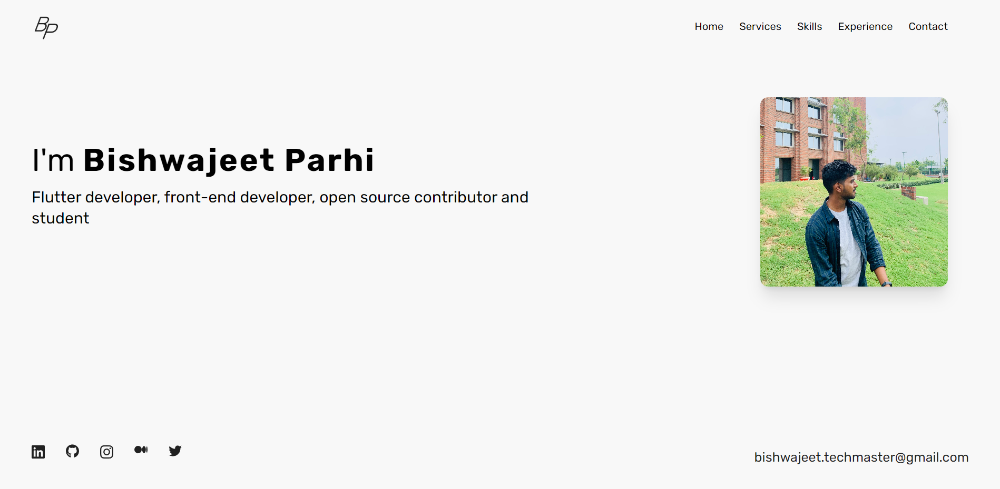
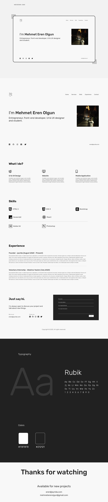

# Portfolio Website



## Tech Stack

**This website is built with:**

- [TailwindCSS](https://tailwindcss.com/), a CSS library to rapidly design components using HTML classes.

- [Svelte](https://svelte.dev/), a JS library to build reactive frontend. Alongside this, application uses [TypeScript](https://www.typescriptlang.org/).

- [Vite](https://vitejs.dev), a build tool that aims to provide a faster and leaner development experience.

- [Vercel](https://vercel.com/), a static site hosting with amazing deployment flow using Git

## Inspiration

This website design is inpired by [Mehmet Eren Olgun](https://www.mehmeterenolgun.com/). You can look at his design and his work at [behance.net](https://www.behance.net/mehmeterenolgun)

## Building

### Running Locally

- Make sure you have [NodeJs](https://nodejs.dev/) installed.

- Fork and clone this repository

- `cd` into folder

**Type the following commands**

```bash
# install dependencies
$ npm install

# run up the local host
$ npm run dev
```

Now visit [localhost:3000](http://localhost:3000)

**Voila 🎉** . You can run the local build successfully

### Developing in Gitpod
Just click on the button below to start developing in Gitpod.

[](https://gitpod.io/https://github.com/2002Bishwajeet/2002bishwajeet-portfolio)

### Add your data

- Add your profile picture with name `profile.png` in assets folder.

* For logo, I made one using Adobe Photoshop, if you want to use your own logo, you can add it with name `logo-dark.png` in assets folder. Or just remove this from the `src/lib/Header.svelte` file.

- Same goes for `favicon.ico`. Replace it in the `public` folder.

 Rename `biswa.json` with username of your choice

Replace with the `json` below with appropriate date
Make sure you remove these comments when adding in `json` Files.
Or rename it with `.jsonc` - Its `json` with comments.

For Icons, I have used [iconify](https://iconify.design/). For icons data
refer to the [icon-sets.iconify.design](https://icon-sets.iconify.design/) and use that if in `icon` field.

```jsonc
{
  "name": "[YOUR-NAME-HERE]",
  "tagline": "[YOUR-TAG-LINE]",
  "nickname": "[NICKNAME]",
  "email": "[YOUR-EMAIL-ID]",
  "github": "[YOUR-GITHUB-URL]",
  "twitter": "[YOUR-TWITTER-URL]",
  "medium": "[YOUR-MEDIUM-URL]",
  "linkedin": "[YOUR-LINKEDIN-URL]",
  "instagram": "[YOUR-INSTAGRAM-URL]",
  "services": [
    {
      "icon": "ri:flutter-fill",
      "title": "Flutter Developer",
      "description": "Accusam dolores voluptua amet clita nonumy, erat kasd kasd tempor dolores. Ipsum lorem kasd ipsum vero, lorem sadipscing ea ut."
    },
    {
      "icon": "dashicons:welcome-write-blog",
      "title": "Content writer",
      "description": "Invidunt labore sed diam et no sed et lorem et aliquyam, voluptua accusam dolor duo amet et et. Dolores sit."
    },
    {
      "icon": "ri:open-source-fill",
      "title": "Open Source Contributor",
      "description": "Ipsum takimata no dolor ea ipsum takimata voluptua sadipscing lorem, dolor magna invidunt ut diam erat amet, ipsum sea invidunt."
    }
  ],
  "skills": {
    "technology": [
      {
        "icon":  "ri:flutter-fill",
        "title": "Flutter"
      },

      {
        "icon": "simple-icons:svelte",
        "title": "Svelte"
      },

      {
        "icon": "akar-icons:javascript-fill",
        "title": "JavaScript"
      },
      {
        "icon": "cib:typescript",
        "title": "TypeScript"
      },
    ],
    "tools": [
      {
        "icon": "cib:adobe-photoshop",
        "title": "Adobe Photoshop"
      },
      {
        "icon": "cib:adobe-xd",
        "title": "Adobe XD"
      },
      {
        "icon": "simple-icons:gitpod",
        "title": "Gitpod"
      }
    ]
  },
  "experience": [
    {
      "title": "Flutter Developer",
      "company": "Presence",
      "date_joining": "October 2021",
      "date_left": "February 2022",
      "description": "Sit lorem sed labore justo sanctus duo sed sit dolor, et voluptua ea stet est gubergren kasd, nonumy diam takimata et lorem nonumy et tempor tempor, consetetur gubergren clita et est dolor aliquyam. Diam labore dolore no duo stet elitr,."
    },
    {
      "title": "Open Source Contributor",
      "company": "Appwrite",
      "date_joining": "September 2021",
      "date_left": "Present",
      "description": "At gubergren magna diam sanctus consetetur no dolores sed no ut, clita kasd lorem eirmod consetetur invidunt elitr sanctus stet,. "
    }
  ]
}
```

That's it. Goto `src/App.svelte` and check if your json file has been imported properly.

**And it should work🎉.**


## Overview

**Original design** : [behance.net/mehmeterenolgun](https://www.behance.net/gallery/102515935/Personal-Website?tracking_source=search_projects%7Cpersonal%20website)



## License

This project is [GPL-3.0 licensed](https://www.gnu.org/licenses/gpl-3.0.en.html). If you are thinking of using this website as your own portfolio or for your own uses, please do proper credit by linking back to [bishwajeetparhi.dev](bishwajeetparhi.dev) and the designer [author](https://www.mehmeterenolgun.com/).

---
# 📚 Svelte + TS + Vite (Generated)

This template should help get you started developing with Svelte and TypeScript in Vite.

## Recommended IDE Setup

[VS Code](https://code.visualstudio.com/) + [Svelte](https://marketplace.visualstudio.com/items?itemName=svelte.svelte-vscode).

## Need an official Svelte framework?

Check out [SvelteKit](https://github.com/sveltejs/kit#readme), which is also powered by Vite. Deploy anywhere with its serverless-first approach and adapt to various platforms, with out of the box support for TypeScript, SCSS, and Less, and easily-added support for mdsvex, GraphQL, PostCSS, Tailwind CSS, and more.

## Technical considerations

**Why use this over SvelteKit?**

- It brings its own routing solution which might not be preferable for some users.
- It is first and foremost a framework that just happens to use Vite under the hood, not a Vite app.
  `vite dev` and `vite build` wouldn't work in a SvelteKit environment, for example.

This template contains as little as possible to get started with Vite + TypeScript + Svelte, while taking into account the developer experience with regards to HMR and intellisense. It demonstrates capabilities on par with the other `create-vite` templates and is a good starting point for beginners dipping their toes into a Vite + Svelte project.

Should you later need the extended capabilities and extensibility provided by SvelteKit, the template has been structured similarly to SvelteKit so that it is easy to migrate.

**Why `global.d.ts` instead of `compilerOptions.types` inside `jsconfig.json` or `tsconfig.json`?**

Setting `compilerOptions.types` shuts out all other types not explicitly listed in the configuration. Using triple-slash references keeps the default TypeScript setting of accepting type information from the entire workspace, while also adding `svelte` and `vite/client` type information.

**Why include `.vscode/extensions.json`?**

Other templates indirectly recommend extensions via the README, but this file allows VS Code to prompt the user to install the recommended extension upon opening the project.

**Why enable `allowJs` in the TS template?**

While `allowJs: false` would indeed prevent the use of `.js` files in the project, it does not prevent the use of JavaScript syntax in `.svelte` files. In addition, it would force `checkJs: false`, bringing the worst of both worlds: not being able to guarantee the entire codebase is TypeScript, and also having worse typechecking for the existing JavaScript. In addition, there are valid use cases in which a mixed codebase may be relevant.

**Why is HMR not preserving my local component state?**

HMR state preservation comes with a number of gotchas! It has been disabled by default in both `svelte-hmr` and `@sveltejs/vite-plugin-svelte` due to its often surprising behavior. You can read the details [here](https://github.com/rixo/svelte-hmr#svelte-hmr).

If you have state that's important to retain within a component, consider creating an external store which would not be replaced by HMR.

```ts
// store.ts
// An extremely simple external store
import { writable } from 'svelte/store'
export default writable(0)
```
